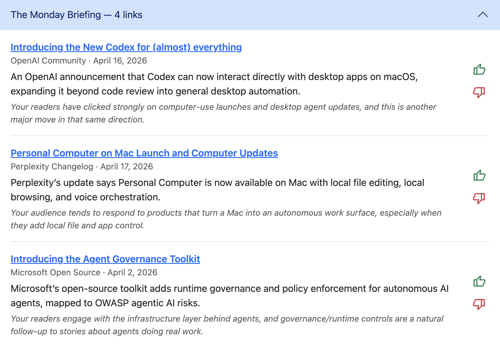
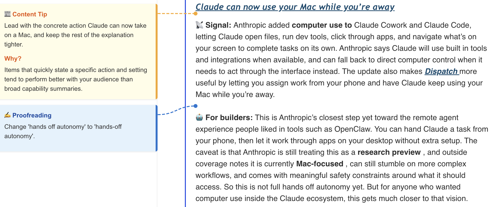
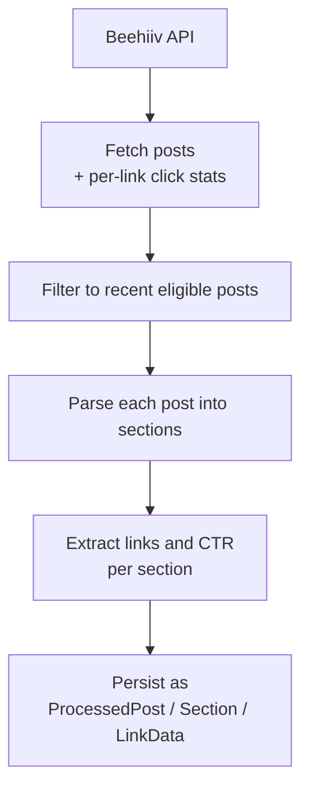
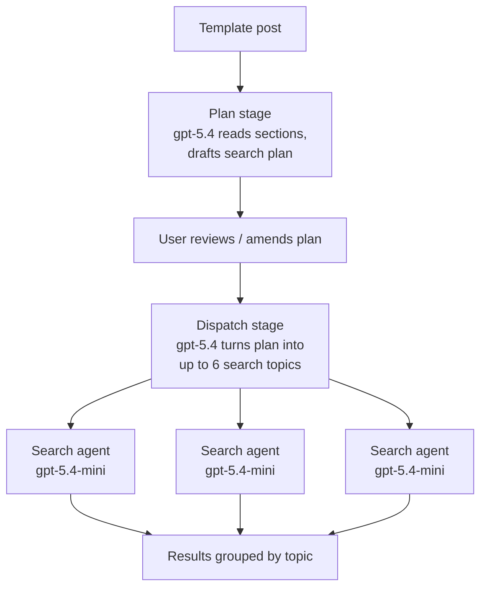
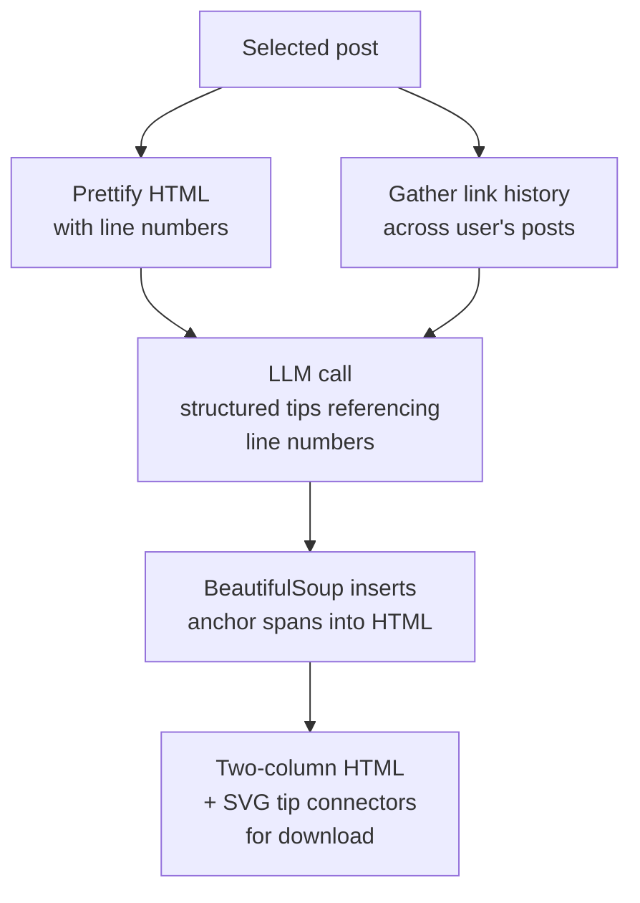

# LetterPulse

LetterPulse is an LLM-powered application designed to assist Beehiiv newsletter writers in writing more engaging posts by learning what their audience responds to and acting on that knowledge.

It works by pulling each user's click data from Beehiiv, identifying the topics and link types their subscribers actually engage with, and using that signal to power the two capabilities below.

This is a personal project that I test-marketed but decided not to launch. I may return to it someday if the circumstances are right.

## Capabilities

### Finds new content ideas
Proposes new post topics tailored to the audience's demonstrated interests.



### Suggests post improvements
Annotates a draft with tips informed by what's worked before.



## How it works

### Post processing

LetterPulse pulls each user's posts from the Beehiiv API along with per-link click statistics, parses the HTML of the most recent eligible posts into sections, and stores the resulting sections and link-level CTRs as the dataset that the LLM-powered features draw on.



### Content Finder

The most involved feature is the **Content Finder**, which runs a three-stage agentic pipeline on a chosen template post. A first call drafts a search plan from the post's sections; once the user accepts or amends it, a second call distills the plan into a list of search topics; each topic is then dispatched to a parallel mini-agent that runs three rounds of web search before returning a structured result.



Conversation context is carried across stages by appending each stage's output items to the next stage's input, so the dispatch and search calls see the full reasoning history.

### Post annotation

The Improvement Tips feature renders a draft as a two-column annotated HTML document with inline tip cards. The post HTML is prettified and line-numbered, then handed to an LLM along with the user's historical link-click data; the LLM returns structured tips that reference specific line numbers, which are wired back into the rendered HTML as anchor spans so each tip card can draw an SVG connector to the exact passage it refers to.



## Project layout

```
app/
├── analytics/                       # main Django app
│   ├── models.py                    # Publication, Post, ProcessedPost, Section, LinkData, Pending* tasks, LLMCall, Feedback
│   ├── admin.py                     # Django admin registrations
│   ├── urls.py                      # all routes under the `analytics:` namespace
│   ├── views/                       # request handlers, split by feature
│   │   ├── insights.py              #   Write page
│   │   ├── learning.py              #   initial audience scan + incremental updates
│   │   ├── content_finder.py        #   content-idea search (plan → dispatch → search)
│   │   ├── improvement_tips.py      #   annotated-HTML tips export
│   │   ├── monetize.py              #   Monetize page + niche analysis
│   │   ├── account.py               #   account / credentials / credits
│   │   ├── public.py                #   public landing
│   │   └── feedback.py              #   feedback submission
│   ├── utils/                       # business logic, importable from views
│   │   ├── beehiiv_api.py           #   Beehiiv HTTP client
│   │   ├── llm.py                   #   OpenAI Responses API wrapper
│   │   ├── credits.py               #   billing / quota
│   │   ├── posts.py, sections.py,   #   post fetching + processing
│   │   │   links.py, text.py
│   │   ├── post_selection.py        #   picks which posts to process
│   │   ├── learning.py,             #   per-feature workflows (background tasks)
│   │   │   content_finder.py,
│   │   │   improvement_tips.py,
│   │   │   niche.py
│   │   └── background.py            #   background-thread runner
│   ├── llm_tracker.py               # contextvar accumulator for per-LLM-call metadata
│   ├── logsink.py, logutils.py      # async queue-based logging (ExecutionLog, LLMCall)
│   ├── templates/analytics/         # Django templates
│   ├── static/analytics/            # JS, CSS, images (including readme screenshots)
│   ├── migrations/
│   └── tests/                       # pytest-django tests
├── beehiiv_analytics/               # Django project package
│   ├── settings.py
│   ├── test_settings.py             #   SQLite in-memory, migrations disabled, MD5 hasher
│   └── urls.py
├── manage.py
├── requirements.txt
├── Dockerfile                       # python:3.11-slim, gunicorn
├── run_local_dev.sh                 # venv + Postgres-in-Docker on host port 5433
├── run_local.sh                     # Docker against the cloud DB
├── push_to_ecr.sh                   # build & push image to AWS ECR (dev/prod)
├── pytest.ini
├── claude.md                        # architecture + workflow notes (LLM/agent guide)
└── readme.md
```